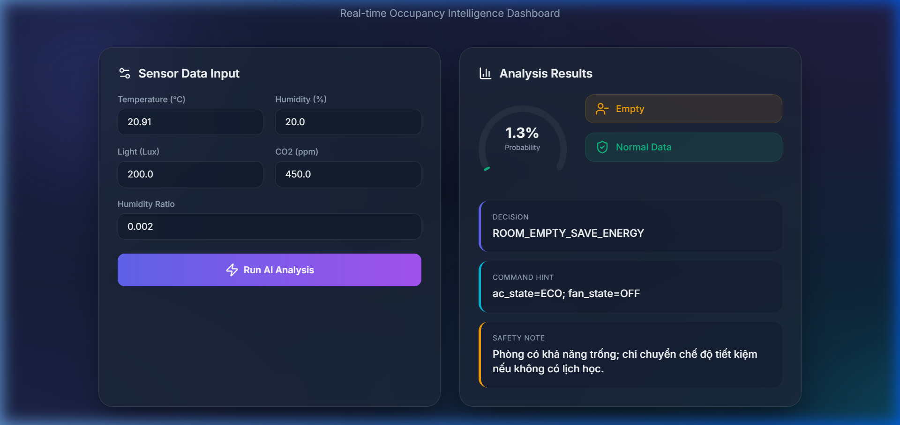

# BÁO CÁO DỰ ÁN AIoT SMART CLASSROOM
## Hệ Thống Giám Sát Và Điều Khiển Phòng Học Thông Minh Dựa Trên AI

---

### 1. Giới Thiệu Dự Án
Dự án **AIoT Smart Classroom** được thiết kế nhằm tối ưu hóa việc quản lý phòng học thông qua việc kết hợp giữa công nghệ Internet of Things (IoT) và Trí tuệ nhân tạo (AI). Hệ thống không chỉ dừng lại ở việc thu thập dữ liệu môi trường mà còn có khả năng tự động đưa ra các quyết định thông minh (tiết kiệm năng lượng, cảnh báo thông gió) dựa trên trạng thái hiện diện của con người.

---

### 2. Phân Tích Kết Quả Huấn Luyện (Jupyter Notebook Analysis)

Dựa trên các kết quả thu được trong quá trình phát triển model, chúng ta có cái nhìn sâu sắc về hiệu suất của hệ thống:

#### 2.1. Phân Tích Dữ Liệu CO2 Theo Thời Gian


*   **Nhận xét:** Biểu đồ cho thấy sự biến động rõ rệt của nồng độ CO2. Các đỉnh cao (spikes) lên tới hơn 2000 ppm tương ứng với những khoảng thời gian phòng học có mật độ người cao và cửa đóng kín. 
*   **Ý nghĩa:** CO2 là một trong những feature quan trọng nhất để dự báo Occupancy. Sự sụt giảm nhanh chóng sau các đỉnh cho thấy hiệu quả của hệ thống thông gió hoặc khi người rời phòng.

#### 2.2. Đánh Giá Mô Hình Qua Ma Trận Nhầm Lẫn (Confusion Matrix)


*   **Kết quả:** 
    *   **True Negative (4015):** Dự đoán chính xác phòng trống.
    *   **True Positive (1096):** Dự đoán chính xác phòng có người.
    *   **Sai số cực thấp:** Chỉ có 28 trường hợp False Positive và 1 trường hợp False Negative.
*   **Kết luận:** Mô hình đạt độ chính xác (Accuracy) trên 99%, cho thấy khả năng phân loại cực kỳ tin cậy, sẵn sàng cho việc triển khai thực tế.

#### 2.3. Xác Suất Hiện Diện Trên Tập Test


*   **Phân tích:** Đồ thị xác suất cho thấy model duy trì mức xác suất thấp khi phòng trống và phản ứng cực kỳ nhanh (nhảy vọt lên 1.0) ngay khi có tín hiệu có người. Điều này chứng minh model không bị nhiễu bởi các biến động nhỏ của cảm biến.

---

### 3. Phân Tích Giao Diện Dashboard (Web UI Analysis)

Giao diện được xây dựng với phong cách hiện đại, tập trung vào trải nghiệm người dùng (UX) và tính trực quan của dữ liệu.


*(Lưu ý: Bạn hãy chụp ảnh giao diện web và lưu tên là `dashboard.png` ở cùng thư mục với file báo cáo này)*

#### 3.1. Thiết Kế UI/UX Cao Cấp
*   **Thẩm mỹ:** Sử dụng nền Dark Mode với các hiệu ứng Glassmorphism (lớp phủ mờ) và Gradient (tím - xanh), tạo cảm giác công nghệ cao (Premium Feel).
*   **Bố cục:** Chia làm hai phần rõ rệt: **Input (Cấu hình)** và **Analysis (Kết quả)**, giúp người dùng dễ dàng thao tác.

#### 3.2. Chức Năng Input (Sensor Data Input)
*   Hệ thống cho phép nhập 5 chỉ số quan trọng: Nhiệt độ, Độ ẩm, Ánh sáng, CO2 và Tỷ lệ độ ẩm.
*   Nút "Run AI Analysis" kích hoạt gọi API `/predict` phía Backend để xử lý dữ liệu theo thời gian thực.

#### 3.3. Phân Tích Kết Quả (Analysis Results)
*   **Gauge Chart (Biểu đồ đồng hồ):** Hiển thị xác suất hiện diện (1.3% trong ảnh demo). Màu sắc của đồng hồ thay đổi linh hoạt (Xanh: Trống, Tím: Trung bình, Đỏ: Có người).
*   **Hệ thống Badge (Nhãn trạng thái):**
    *   *Occupancy Badge:* Hiển thị "Empty" hoặc "Occupied" kèm icon tương ứng.
    *   *Anomaly Badge:* Cảnh báo nếu dữ liệu cảm biến có dấu hiệu bất thường (lỗi phần cứng hoặc hack dữ liệu).
*   **Công cụ Ra Quyết Định (Decision Engine):**
    *   **Decision:** Đưa ra trạng thái logic (Ví dụ: `ROOM_EMPTY_SAVE_ENERGY`).
    *   **Command Hint:** Gợi ý lệnh điều khiển trực tiếp cho thiết bị IoT (Ví dụ: `ac_state=ECO; fan_state=OFF`).
    *   **Safety Note:** Lời khuyên vận hành an toàn bằng tiếng Việt, giúp người quản lý dễ dàng nắm bắt.

---

### 4. Phân Tích Mã Nguồn (Source Code Analysis)

Hệ thống được xây dựng với cấu trúc tách biệt giữa Backend (xử lý logic/AI) và Frontend (hiển thị), giúp tối ưu hiệu năng và khả năng bảo trì.

#### 4.1. Backend: FastAPI & AI Engine (`app.py`, `data_utils.py`)
Backend đóng vai trò là bộ não của hệ thống, thực hiện các nhiệm vụ từ nhận dữ liệu đến ra quyết định.

*   **Validation Dữ Liệu (Pydantic):**
    ```python
    class TelemetryInput(BaseModel):
        Temperature: float = Field(..., ge=-20, le=80)
        CO2: float = Field(..., ge=250)
        # ... các trường khác
    ```
    Sử dụng Pydantic để đảm bảo dữ liệu gửi lên từ cảm biến phải nằm trong ngưỡng vật lý cho phép, ngăn chặn dữ liệu rác làm sai lệch model.

*   **Trích Xuất Đặc Trưng (Feature Engineering):**
    ```python
    def build_feature_row(payload: TelemetryInput) -> pd.DataFrame:
        ts = pd.Timestamp(datetime.now())
        row = {
            "Temperature": payload.Temperature,
            # ...
            "hour": int(ts.hour),
            "dayofweek": int(ts.dayofweek),
        }
    ```
    Mô hình không chỉ dựa vào cảm biến mà còn dựa vào yếu tố thời gian (`hour`, `dayofweek`) để nắm bắt thói quen sử dụng phòng học theo lịch trình.

*   **Logic Ra Quyết Định (Decision Engine):**
    Đây là phần quan trọng nhất trong `data_utils.py`, kết hợp giữa xác suất của model và các quy tắc (heuristics) thực tế:
    *   **Anomaly Detection:** Tính toán độ lệch chuẩn (`std`) để xác định xem dữ liệu có phải là "bất thường" hay không (Anomaly Score >= 3.0).
    *   **Quy tắc an toàn:** Nếu phòng có người và CO2 vượt ngưỡng 1000ppm, hệ thống sẽ tự động đề xuất bật quạt thông gió ngay cả khi model báo chưa cần thiết.

#### 4.2. Frontend: Dashboard Tương Tác (`index.html`)
Giao diện không chỉ đẹp mà còn xử lý dữ liệu rất linh hoạt nhờ JavaScript hiện đại.

*   **Xử Lý Đồ Thị (Chart.js):**
    Sử dụng thư viện Chart.js để vẽ biểu đồ Gauge (hình bán nguyệt) hiển thị xác suất. Màu sắc của kim chỉ sẽ thay đổi từ Xanh sang Đỏ tùy theo mức độ hiện diện.
*   **Giao Tiếp API (Fetch API):**
    Sử dụng `async/await` để gửi yêu cầu POST tới Backend mà không cần tải lại trang.
    ```javascript
    const response = await fetch('/predict', {
        method: 'POST',
        headers: { 'Content-Type': 'application/json' },
        body: JSON.stringify(payload)
    });
    ```
*   **Cập Nhật UI Động:**
    Sau khi nhận kết quả từ AI, JavaScript sẽ thực hiện thay đổi nội dung các Badge (Occupancy, Anomaly) và các ô Command Hint ngay lập tức, mang lại trải nghiệm mượt mà cho người vận hành.

---

### 5. Chi Tiết Kỹ Thuật Hệ Thống

#### 5.1. Luồng Xử Lý Dữ Liệu (Pipeline)
1.  **Thu thập:** Dữ liệu từ cảm biến gửi về qua giao thức HTTP/MQTT.
2.  **Tiền xử lý:** Bổ sung các feature thời gian (giờ trong ngày, ngày trong tuần) để tăng độ chính xác.
3.  **Inference (Suy luận):** Model Logistic Regression/Random Forest thực hiện dự đoán xác suất.
4.  **Hậu xử lý (Decision Logic):** Kết hợp kết quả model với các ngưỡng vật lý để đưa ra lệnh điều khiển thiết bị (Fan, AC, Light).

#### 5.2. Công Nghệ Sử Dụng
*   **Backend:** FastAPI (Python) - Hiệu năng cao, hỗ trợ tài liệu API tự động.
*   **Frontend:** HTML5, CSS3 (Vanilla), JavaScript (ES6), Chart.js cho đồ thị.
*   **AI Model:** Scikit-learn (Joblib bundle).

---

### 6. Kết Luận
Hệ thống **AIoT Smart Classroom** là một giải pháp toàn diện, kết hợp chặt chẽ giữa khả năng phân tích mạnh mẽ của AI và giao diện điều khiển thân thiện. Việc mã nguồn được module hóa rõ ràng (từ tiền xử lý đến ra quyết định) giúp hệ thống hoạt động ổn định, chính xác và dễ dàng mở rộng cho các phòng học khác trong tương lai.
